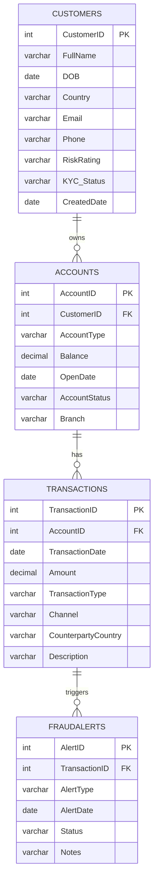

# 🏦 Banking AML & Fraud Detection — SQL Project

**Author:** Nikhil Madasu — SQL Developer @ TCS (2.8 Years Experience)

A SQL Server project that models a retail banking dataset end-to-end —
schema design, data cleaning, data quality validation, and analytical
querying — to detect Anti-Money Laundering (AML) red flags such as
structuring, high-risk-jurisdiction transfers, rapid fund movement,
round-amount transactions, and dormant account reactivation.

---

## 📌 Why This Project

Banks are legally required to monitor transactions for money-laundering
red flags. Raw banking data is rarely clean — inconsistent formatting,
duplicate customer records, missing values — so before any fraud pattern
can be detected, the data has to be cleaned and validated first. This
project simulates that full real-world workflow in T-SQL:

**Raw data → Schema → Cleaning → Validation → Fraud Analysis**

---

## 🗂 Project Structure

```
banking-aml-fraud-detection/
├── schema_ddl.sql        -- Table definitions (Customers, Accounts, Transactions, FraudAlerts)
├── seed_data.sql         -- Sample data with intentional data-quality issues + fraud patterns
├── views_clean.sql       -- Data-cleaning views (standardization, deduplication, NULL handling)
├── quality_checks.sql    -- Automated validation suite for the cleaned views
├── fraud_queries.sql     -- 7 AML analytical queries (structuring, high-risk countries, etc.)
└── README.md
```

---

## 🧩 Entity Relationship Diagram



**Relationships:** One customer → many accounts → many transactions → many
fraud alerts.
- `Accounts.CustomerID` → `Customers.CustomerID`
- `Transactions.AccountID` → `Accounts.AccountID`
- `FraudAlerts.TransactionID` → `Transactions.TransactionID`

---

## 🧱 Schema Details

### `Customers`
| Column | Type | Notes |
|---|---|---|
| CustomerID | INT (PK) | Unique customer identifier |
| FullName | VARCHAR(100) | |
| DOB | DATE | |
| Country | VARCHAR(50) | |
| Email | VARCHAR(100) | |
| Phone | VARCHAR(20) | |
| RiskRating | VARCHAR(10) | Low / Medium / High |
| KYC_Status | VARCHAR(20) | Verified / Pending / Not Verified |
| CreatedDate | DATE | |

### `Accounts`
| Column | Type | Notes |
|---|---|---|
| AccountID | INT (PK) | Unique account identifier |
| CustomerID | INT (FK) | → Customers |
| AccountType | VARCHAR(20) | Savings / Current / Fixed Deposit |
| Balance | DECIMAL(18,2) | |
| OpenDate | DATE | |
| AccountStatus | VARCHAR(20) | Active / Dormant / Closed |
| Branch | VARCHAR(50) | |

### `Transactions`
| Column | Type | Notes |
|---|---|---|
| TransactionID | INT (PK) | Unique transaction identifier |
| AccountID | INT (FK) | → Accounts |
| TransactionDate | DATE | |
| Amount | DECIMAL(18,2) | |
| TransactionType | VARCHAR(20) | Deposit / Withdrawal / Transfer / Wire |
| Channel | VARCHAR(20) | ATM / Online / Branch / Wire |
| CounterpartyCountry | VARCHAR(50) | |
| Description | VARCHAR(200) | |

### `FraudAlerts`
| Column | Type | Notes |
|---|---|---|
| AlertID | INT (PK) | Unique alert identifier |
| TransactionID | INT (FK) | → Transactions |
| AlertType | VARCHAR(50) | Structuring / HighRiskCountry / RapidMovement / RoundAmount / DormantReactivation / DuplicateTransaction |
| AlertDate | DATE | |
| Status | VARCHAR(20) | Open / Closed / Escalated / False Positive |
| Notes | VARCHAR(200) | |

---

## 🧹 Data Cleaning

The seed data intentionally includes real-world data quality issues —
inconsistent casing (`'india'` vs `'INDIA'`), stray whitespace, NULLs, and
duplicate customer records (the same person entered twice under different
IDs). `views_clean.sql` resolves all of this **without altering the raw
tables**, using standardization, `COALESCE`, and `ROW_NUMBER()`-based
deduplication:

| View | What it cleans |
|---|---|
| `vw_CustomersClean` | Standardizes casing, resolves duplicate customers by email, normalizes RiskRating & KYC_Status, fills missing DOB |
| `vw_AccountsClean` | Remaps duplicate CustomerIDs, normalizes AccountType & AccountStatus, fills missing Balance with 0.00 |
| `vw_TransactionsClean` | Standardizes casing, deduplicates transactions, fills missing Description |
| `vw_FraudAlertsClean` | Standardizes Status values, fills missing Notes, filters to alerts on valid transactions |

## ✅ Data Quality Validation

`quality_checks.sql` runs an automated suite confirming the cleaning logic
worked correctly — **13 checks, all passing**:

- ✅ No NULLs remaining in key fields (RiskRating, Balance)
- ✅ No duplicate transactions or duplicate customer emails
- ✅ No orphaned foreign keys across all four tables
- ✅ No negative transaction amounts or future-dated transactions
- ℹ️ Informational counts for legitimate business states (e.g. Pending KYC)

---

## 🔎 AML Business Questions Answered

`fraud_queries.sql` maps 7 analytical queries directly to real AML
monitoring use cases:

| # | Business Question | Fraud Typology |
|---|---|---|
| 1 | Which accounts made 3+ cash deposits just under the $10,000 threshold within a 7-day window? | Structuring / Smurfing |
| 2 | Which transactions over $10,000 involve a counterparty in a high-risk jurisdiction? | Sanctions / High-Risk Country Exposure |
| 3 | Which accounts have generated the most fraud alerts, and what is their combined alerted amount? | Alert Concentration |
| 4 | What percentage of fraud alerts are Open, Closed, Escalated, or False Positive? | Alert Triage / Caseload Monitoring |
| 5 | Which High-risk-rated customers hold more than one account and have incomplete KYC? | Enhanced Due Diligence Priority |
| 6 | Which accounts marked Dormant show transaction activity, and how large was it? | Dormant Account Reactivation |
| 7 | What is the total transaction volume, per branch, per month? | Baseline Volume Monitoring |

---

## 💡 Key Findings

Running the analysis against the sample dataset surfaced concrete,
actionable insights — exactly the kind of output an AML analyst would
escalate:

- **Structuring detected** on Account 104 — 4 cash deposits totaling
  $38,300 ($9,500 / $9,700 / $9,200 / $9,900), all just under the $10,000
  reporting threshold, made within a **3-day span** (Feb 1–4, 2024).
- **100% of High-risk-rated customers had incomplete KYC** (`Pending` or
  `Not Verified`) — a serious compliance gap, since high-risk customers
  should carry the *most* complete verification, not the least.
- **Dormant account reactivation** — Account 118 (marked Dormant) suddenly
  processed a **$45,000 wire transfer** to the UAE, a classic red flag for
  money muling.
- **High-risk-country exposure** — 4 transactions over $10,000 were routed
  through Iran ($48,000 wire), North Korea ($62,000 wire), Russia ($15,000
  wire), and UAE ($45,000 wire) — all isolated for immediate review.
- **Fraud alert triage distribution**: 50% Open, 20% Escalated, 20% Closed,
  10% False Positive — showing an active, unresolved caseload (70% of
  alerts still open or escalated) that supports prioritizing investigator
  workload.

---

## 🚀 How to Run

1. Open the project in **SQL Server Management Studio (SSMS)**.
2. Execute the scripts in order against a SQL Server instance:
   ```sql
   :r schema_ddl.sql
   :r seed_data.sql
   :r views_clean.sql
   :r quality_checks.sql
   :r fraud_queries.sql
   ```
   (or open and run each file individually)
3. Confirm all checks in `quality_checks.sql` return `0` for
   "remaining"/"orphaned" counts.
4. Explore the output of `fraud_queries.sql` to see flagged accounts and
   transactions.

---

## 🛠 Tech Stack & SQL Techniques

- **SQL Server (T-SQL)** + **SSMS**
- Views, CTEs, subqueries, window functions (`ROW_NUMBER()`, `SUM() OVER()`)
- `CASE`-based categorical standardization
- Multi-table `JOIN`s, `GROUP BY` / `HAVING` aggregation
- Data quality/validation query design

---

## 👤 About the Author

**Nikhil Madasu**
SQL Developer | 2.8 Years of Experience | Tata Consultancy Services (TCS)

Experienced in writing and optimizing T-SQL for data cleaning, validation,
and analytical reporting in enterprise environments. This project
demonstrates practical SQL Server skills applied to a real-world domain —
banking/AML fraud monitoring — covering schema design, data quality
engineering, and business-driven analytical querying.

📫 [LinkedIn](#) &nbsp;|&nbsp; 💻 [GitHub](#)

---

## 📄 License

This project uses synthetic, fictional data for educational/portfolio
purposes only. No real customer or transaction data is included.
